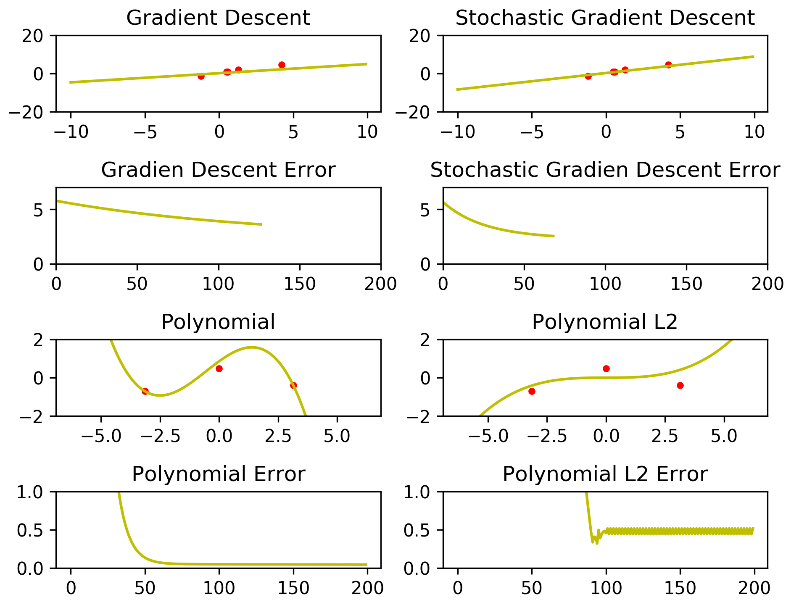

# linear-regression-py
## Introduction
Simple linear regression in python.


## Development
To begin easy development Docker is a prerequsit.

When you have it, just run bellow command to setup
environment
```
./script/bootstrap
```

To run first example run
```
./script/python src/__init__.py
```
